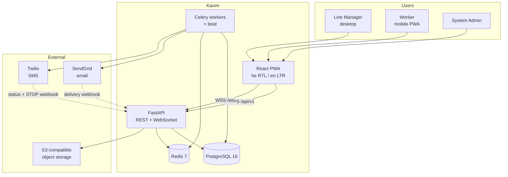
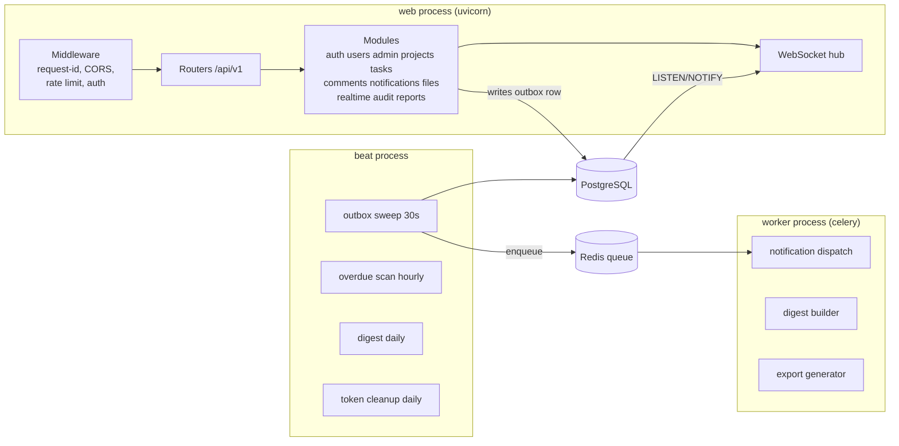
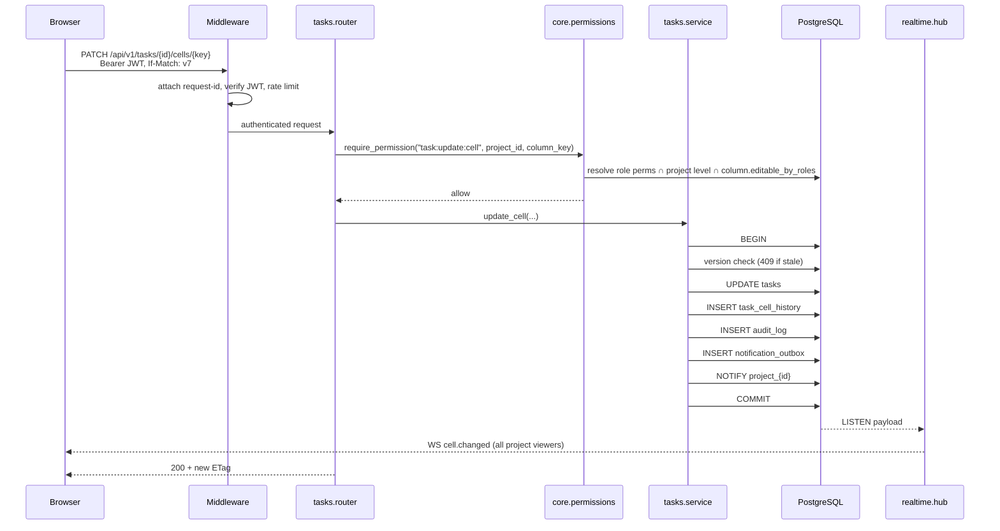
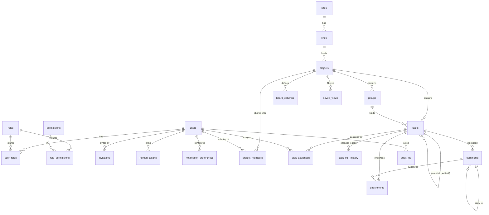
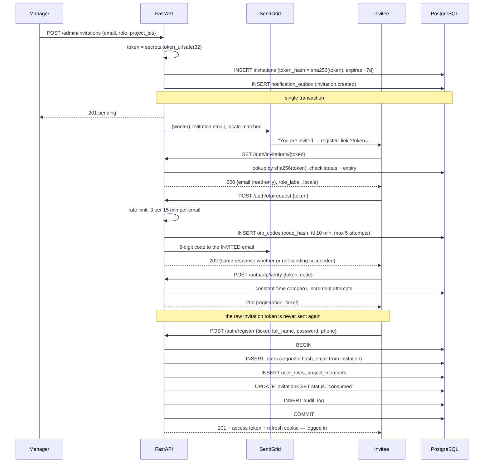

# Kavim · קווים — Master Specification

**Production Line Quality Review & Task Management System**

| Field | Value |
|---|---|
| Document version | 0.2 (draft — refined each step) |
| Date | 2026-07-26 |
| Status | Phase 0 complete — see [`PROGRESS.md`](PROGRESS.md) |
| Owner | eladamir46@gmail.com |
| Repository | https://github.com/EladAM52/kavim_app |
| Local path | local working directory (to be renamed `kavim`) |
| Code identifier | `kavim` |

---

## Table of Contents

1. [System Naming](#1-system-naming)
2. [Scope, Actors, Glossary](#2-scope-actors-glossary)
3. [Functional Requirements](#3-functional-requirements)
4. [Non-Functional Requirements](#4-non-functional-requirements)
5. [Architecture](#5-architecture)
6. [Services](#6-services)
7. [Data Model](#7-data-model)
8. [Authentication, Authorization, Security](#8-authentication-authorization-security)
9. [API Contract](#9-api-contract)
10. [Frontend Architecture, RTL, Responsiveness](#10-frontend-architecture-rtl-responsiveness)
11. [Testing, CI, Quality Gates](#11-testing-ci-quality-gates)
12. [Operations](#12-operations)
13. [Roadmap](#13-roadmap)
14. [Risks and Open Questions](#14-risks-and-open-questions)
15. [Technology Decision Record](#15-technology-decision-record)

---

## 1. System Naming

Eight candidates, evaluated on clarity to a plant-floor worker, pronounceability in Hebrew and English, and namespace cleanliness.

| Name | Rationale | Verdict |
|---|---|---|
| **Kavim** (קווים, "lines") | Hebrew-native, distinctive, immediately meaningful to Israeli plant staff. Doubles as "production lines" and "rows on a board", which is exactly what the product is. Opaque to English-speaking stakeholders, but the primary UI language is Hebrew, so that trade is the right way round. | **Chosen** |
| **QualiLine** | Quality + production line. Self-explanatory to any stakeholder without a pitch. Pronounces cleanly in Hebrew ("קוואלי-ליין"). | Runner-up |
| **LineIQ** | Short, modern, memorable. Suggests intelligence/analytics. Slightly generic; "IQ" suffix is well-worn. | Viable |
| **AssureFlow** | Quality assurance + workflow. Enterprise register, good for management buy-in. Says less about production lines specifically. | Viable |
| **ShiftBoard** | Shift-oriented, board metaphor explicit — matches the Monday-style UI. Narrows the product to shift management. | Too narrow |
| **Cadence** | Elegant, evokes production rhythm. Name is crowded in software; poor search results. | Reject |
| **Tikun** (תיקון, "correction") | Precise corrective-action meaning, strong for a QA tool. Obscure outside Hebrew; overloaded connotations. | Reject |
| **ProdBoard** | Accurately descriptive. Forgettable. | Reject |

**Decision: Kavim.** Code identifier `kavim`, product name "Kavim", Hebrew display name "קווים".

Naming applies to: Python package root, Docker image names, database name, JWT issuer claim, email sender display name, PWA manifest name.

---

## 2. Scope, Actors, Glossary

### 2.1 Problem statement

A production-line manager runs recurring quality reviews on a line. Today this happens on paper, spreadsheets, or WhatsApp: no audit trail, no visibility into who is blocked, no reliable way to know whether a corrective action was actually closed. The manager needs to open a review, break it into tasks and subtasks, assign workers, and see status roll up — from a phone on the plant floor and from a desktop in the office.

### 2.2 Actors

| Actor | Description | Primary capabilities |
|---|---|---|
| **System Admin** | IT / system owner | Full access. Manages roles and the permission matrix, invites any user, views the audit log, configures integrations |
| **Line Manager** | Owns a production line | Creates quality reviews (projects), defines columns, creates tasks/subtasks, assigns workers, invites workers, views reports |
| **Shift Supervisor** | Runs one shift | Creates and assigns tasks within assigned projects, updates any cell, comments. Cannot change board structure or invite users |
| **Worker** | Line operator | Sees assigned tasks. Updates status, dates, and comments on their own tasks. Uploads evidence photos. Cannot create projects or change structure |
| **Viewer / Auditor** | QA auditor, external reviewer | Read-only across assigned projects. Can export reports. Cannot mutate anything |

### 2.3 Glossary — Monday.com vocabulary mapped to this domain

Fixing vocabulary now prevents three months of the team meaning different things by "board".

| Monday.com | Kavim | Meaning |
|---|---|---|
| Workspace | **Site / Line** | Plant location and production line. Present in the schema from day 1; UI exposure deferred |
| Board | **Project** | One quality review cycle, e.g. "Line 3 Weekly Hygiene Audit — Week 31" |
| Group | **Group** | Section inside a review, e.g. "Shift A", "Packaging Station", "Open Deviations" |
| Item | **Task** | A single check or corrective action |
| Subitem | **Subtask** | A step within a task |
| Column | **Column** | A typed field on the board: status, person, date, number, dropdown, file, … |
| Update | **Comment** | Threaded activity-feed entry on a task, with @mentions and attachments |
| Automation | *(out of scope v1)* | — |

### 2.4 Explicit non-goals for v1

Stating these prevents scope drift. Each is deferrable without architectural rework.

- Formula and mirror columns
- Automation recipes ("when status changes to Done, notify X") — replaced by a fixed set of built-in notification triggers
- Gantt and timeline views
- Time tracking / work logs
- External guest access (users outside the organization)
- Native iOS/Android apps — the PWA covers mobile
- SSO / Entra ID — the data model leaves room, see §14
- Multi-tenancy across organizations — `site_id` scoping is present, full tenant isolation is not

---

## 3. Functional Requirements

Each requirement: `FR-###`, actor, statement, acceptance criteria, priority (**MUST** / SHOULD / COULD).

### FR-1xx — Identity and Onboarding

| ID | Actor | Requirement | Acceptance criteria | Pri |
|---|---|---|---|---|
| FR-101 | Manager, Admin | Invite a new user by email, choosing their role and initial project assignments | Invitation row created; email dispatched; invitation appears in the admin panel as `pending` with an expiry timestamp | MUST |
| FR-102 | System | Invitation tokens are single-use and expire after 7 days | A consumed or expired token returns `410 Gone` with a re-request path; token is never stored in plaintext | MUST |
| FR-103 | Invitee | Open the invitation link and see which email was invited and to what role, before registering | Landing page shows the email read-only (not editable — prevents invitation transfer) and the role label | MUST |
| FR-104 | Invitee | Verify identity via a one-time code sent to the invited email address before being allowed to register | 6-digit code, 10-minute TTL, max 5 verification attempts, max 3 code requests per 15 minutes per email | MUST |
| FR-105 | Invitee | Complete registration by setting full name, password, and phone number | Account created with the invited email and role; invitation atomically marked consumed; user is logged in on success | MUST |
| FR-106 | User | Log in with email and password | Access token returned in the response body; refresh token set as an `httpOnly` cookie | MUST |
| FR-107 | User | Stay logged in across browser restarts without re-entering the password | Refresh token valid 30 days, rotated on every use | MUST |
| FR-108 | User | Reset a forgotten password via an emailed link | Single-use token, 1-hour TTL; all existing sessions revoked on successful reset | MUST |
| FR-109 | System | Lock an account after repeated failed logins | 10 consecutive failures locks the account for 15 minutes; the lock event is audited and the user is emailed | MUST |
| FR-110 | User | Log out, and optionally log out of all devices | Refresh token family revoked; WebSocket connections closed | MUST |
| FR-111 | Manager, Admin | Resend or revoke a pending invitation | Resend issues a new token and invalidates the old one; revoke sets status `revoked` | SHOULD |
| FR-112 | User | Verify the phone number via SMS code, enabling SMS notifications | Twilio-delivered code; `phone_verified_at` set; unverified phones never receive notifications | SHOULD |
| FR-113 | User | Choose interface language (Hebrew / English) at registration and change it later | Selection persists per user and drives both UI language and outbound email/SMS language | MUST |

### FR-2xx — Authorization and Admin Panel

| ID | Actor | Requirement | Acceptance criteria | Pri |
|---|---|---|---|---|
| FR-201 | Admin | View all users with role, status, last login, and project memberships | Paginated, searchable, filterable by role and status | MUST |
| FR-202 | Admin | Change a user's global role | Change takes effect on the user's next request (permission cache invalidated immediately); change is audited | MUST |
| FR-203 | Admin | Edit the role → permission matrix in the UI | Grid of roles × permissions with checkboxes; save is atomic and audited | MUST |
| FR-204 | Manager | Grant a user access to a specific project at a specific level: owner, editor, commenter, or viewer | Effective permission is the intersection of global role and project membership level | MUST |
| FR-205 | Manager | Restrict which roles may edit a given column | `board_columns.editable_by_roles`; a worker attempting to write a manager-only column gets `403` and the cell renders read-only in the UI | MUST |
| FR-206 | Admin | Deactivate a user without deleting them | User cannot log in; sessions revoked; their historical task assignments and comments remain intact and attributed | MUST |
| FR-207 | Admin | Force-logout a user | All refresh tokens in the family revoked; open WebSocket connections dropped | SHOULD |
| FR-208 | Admin, Auditor | View the audit log, filtered by actor, entity, action, and date range | Every mutation is present with actor, timestamp, IP, and a before/after diff | MUST |
| FR-209 | System | Deny by default | Any endpoint without an explicit permission declaration is inaccessible; enforced by a test that enumerates all routes | MUST |
| FR-210 | Admin | See a read-only view of a worker's effective permissions ("why can this person edit this?") | Resolution trace shows global role permissions, project level, and column overrides | COULD |

### FR-3xx — Projects and Board Structure

| ID | Actor | Requirement | Acceptance criteria | Pri |
|---|---|---|---|---|
| FR-301 | Manager | Create a quality review project with name, description, line, and date range | Project created with the creator as owner and a default column set | MUST |
| FR-302 | Manager | Create, rename, reorder, and delete groups within a project | Deleting a non-empty group requires confirmation and moves or deletes its tasks per user choice | MUST |
| FR-303 | Manager | Add a column, choosing its type from the supported set | Column appears immediately for all viewers via WebSocket; no database migration involved | MUST |
| FR-304 | Manager | Configure a status column's options: label, colour, and whether the option counts as "done" | Minimum 2 options; `is_done` drives completion metrics and overdue logic | MUST |
| FR-305 | Manager | Reorder, resize, rename, hide, and delete columns | Deleting a column soft-deletes it and retains historical cell values for 30 days | MUST |
| FR-306 | Manager | Save a project as a reusable template and create a new project from a template | Template captures groups, columns, and optionally task skeletons — not assignees or dates | SHOULD |
| FR-307 | Manager | Duplicate an existing project | Structure copied; assignees and dates optional via checkbox | SHOULD |
| FR-308 | Manager | Archive a completed project | Hidden from the active list, read-only, still exportable and searchable | MUST |
| FR-309 | Any member | See project-level roll-up: task count by status, completion percentage, overdue count | Recomputed on load and pushed on change | MUST |

### FR-4xx — Tasks and Subtasks

| ID | Actor | Requirement | Acceptance criteria | Pri |
|---|---|---|---|---|
| FR-401 | Manager, Supervisor | Create a task in a group | Appears at the requested position for all connected viewers | MUST |
| FR-402 | Manager, Supervisor | Create a subtask under a task | Hierarchy depth is capped at 2 (task → subtask); a deeper attempt returns `422` | MUST |
| FR-403 | Any editor | Assign one or more users to a task | Each new assignee is notified per their channel preferences | MUST |
| FR-404 | Any editor | Reorder tasks by drag-and-drop, within and across groups | Reorder writes a single row (fractional index); order is stable across sessions and concurrent users | MUST |
| FR-405 | Any editor | Select multiple tasks and bulk-update status, assignee, dates, or group | Single atomic request; partial failure reports which rows failed and why | SHOULD |
| FR-406 | Any editor | Duplicate a task with its subtasks | Copy suffixed "(copy)", placed directly below the original | SHOULD |
| FR-407 | Manager | Archive or delete a task | Delete is soft for 30 days and restorable; hard delete is admin-only | MUST |
| FR-408 | Manager | Mark task B as blocked by task A | Warning shown when closing A is pending; a dependency cycle is rejected | COULD |
| FR-409 | Any member | See a parent task's roll-up of subtask completion | Progress bar; parent cannot be set to a done status while subtasks remain open (warning, overridable by manager) | SHOULD |
| FR-410 | Worker | See a personal "My Tasks" view across all projects, sorted by due date | Shows only tasks where the user is an assignee; grouped Overdue / Today / This week / Later | MUST |

### FR-5xx — Cell Editing

| ID | Actor | Requirement | Acceptance criteria | Pri |
|---|---|---|---|---|
| FR-501 | Worker | Update a task's status from the board or from the task detail sheet | Optimistic UI update, rolled back with a toast on server rejection | MUST |
| FR-502 | Worker | Update dates: start date, due date, or a timeline range | Timezone-safe: stored UTC, displayed `Asia/Jerusalem`; a due date before the start date is rejected | MUST |
| FR-503 | Any editor | Edit any cell type inline: text, long text, number, dropdown, checkbox, rating, person, link, email, phone, file | Per-type editor and per-type validation; `Esc` cancels, `Enter` commits, `Tab` moves to the next editable cell | MUST |
| FR-504 | System | Prevent silent overwrites when two users edit the same cell simultaneously | Version check via `If-Match`; a stale write returns `409` with the current value and the UI offers "keep mine / take theirs" | MUST |
| FR-505 | Any member | View the change history of a single cell | Chronological list: who, when, from what, to what | MUST |
| FR-506 | System | Enforce column-level edit permissions server-side | A worker's write to a manager-only column returns `403` and is audited as a denied attempt | MUST |
| FR-507 | Worker | Update a status while offline and have it sync when connectivity returns | Queued in IndexedDB, replayed via background sync, conflicts surfaced to the user | SHOULD |

### FR-6xx — Comments and Attachments

| ID | Actor | Requirement | Acceptance criteria | Pri |
|---|---|---|---|---|
| FR-601 | Any commenter | Post a comment on a task | Appears live for other viewers of that task | MUST |
| FR-602 | Any commenter | Reply to a comment | One level of threading | MUST |
| FR-603 | Any commenter | @mention a project member | Mentioned user is notified regardless of assignment; only project members are suggested | MUST |
| FR-604 | Any commenter | Edit or delete own comment | Edit allowed within 15 minutes and marked "edited"; delete is soft and shows "comment deleted" | SHOULD |
| FR-605 | Worker | Attach evidence photos or documents to a task or comment | Max 25 MB per file, 10 files per task; images get thumbnails; allowed MIME types enforced server-side, not by extension | MUST |
| FR-606 | Worker | Capture a photo directly from a phone camera | `<input capture="environment">`; client-side downscale before upload to survive weak Wi-Fi | MUST |
| FR-607 | Any member | Download or preview an attachment | Time-limited presigned URL, 15-minute TTL | MUST |

### FR-7xx — Notifications

| ID | Actor | Requirement | Acceptance criteria | Pri |
|---|---|---|---|---|
| FR-701 | System | Send email via SendGrid | Localized template per user language; delivery status recorded | MUST |
| FR-702 | System | Send SMS via Twilio | Only to verified phones; E.164 normalized; body under 160 GSM-7 characters where possible | MUST |
| FR-703 | System | Show in-app notifications with an unread badge | Delivered over WebSocket; marking read syncs across the user's devices | MUST |
| FR-704 | System | Trigger notifications on: invitation, assignment, mention, status change on a followed task, due-date reminder, overdue, comment on assigned task, project shared | Each trigger is independently toggleable per user per channel | MUST |
| FR-705 | User | Configure a notification preference matrix: event × channel (email / SMS / in-app) | Defaults are sensible: assignment and mention on all channels, status change in-app only | MUST |
| FR-706 | User | Set quiet hours during which no SMS is sent | Non-urgent messages are deferred to the end of quiet hours; escalations bypass | SHOULD |
| FR-707 | User | Receive one daily digest email instead of individual messages | Per-user opt-in; sent at a configurable hour in `Asia/Jerusalem` | SHOULD |
| FR-708 | System | Escalate an overdue task to the line manager | Hourly scan; escalates once per task per 24 hours to avoid alert fatigue | SHOULD |
| FR-709 | System | Never lose a notification because of a crash between the database commit and the queue enqueue | Transactional outbox: the notification row is written in the same transaction as the domain change and swept by a worker | MUST |
| FR-710 | System | Retry failed deliveries and stop cleanly after exhausting retries | Exponential backoff, max 5 attempts, then a dead-letter row visible to admins | MUST |
| FR-711 | System | Handle SMS opt-out | An inbound `STOP` disables SMS for that number and is recorded | MUST |
| FR-712 | Admin | See a delivery log: recipient, channel, event, status, provider message id, error | Filterable, retryable per row | SHOULD |

### FR-8xx — Views, Filters, Search

| ID | Actor | Requirement | Acceptance criteria | Pri |
|---|---|---|---|---|
| FR-801 | Any member | See a project as a table (board) with all columns | Virtualized: 500 tasks scroll smoothly | MUST |
| FR-802 | Any member | Use the mobile card view on a small screen | Under 768px, the grid is replaced by a card list — not a horizontally squeezed table | MUST |
| FR-803 | Any member | See a Kanban view grouped by status column | Drag a card between columns to change status | SHOULD |
| FR-804 | Any member | Filter by status, assignee, group, date range, and any custom column | Filters combine with AND; each is removable as a chip | MUST |
| FR-805 | Any member | Sort by any column, ascending or descending | Sort state is part of the shareable URL | MUST |
| FR-806 | Any member | Save a filter/sort combination as a named view | Private by default; a manager may share a view with the project | SHOULD |
| FR-807 | Any member | Full-text search tasks and comments across accessible projects | Postgres `tsvector`; results respect permissions; Hebrew and English both searchable | MUST |

### FR-9xx — Reports and Export

| ID | Actor | Requirement | Acceptance criteria | Pri |
|---|---|---|---|---|
| FR-901 | Manager | See a project dashboard: completion rate over time, status distribution, overdue count, per-worker load | Charts render under 1 s for a 500-task project | SHOULD |
| FR-902 | Manager, Auditor | Export a project or a filtered view to CSV or XLSX | Respects current filters and column visibility; large exports run in a worker and email a download link | MUST |
| FR-903 | Auditor | Export the audit log for a date range | CSV; admin/auditor only; the export itself is audited | SHOULD |
| FR-904 | Manager | See cross-project metrics for a line over a period | Reviews completed, average closure time, recurring deviation types | COULD |

---

## 4. Non-Functional Requirements

| ID | Category | Requirement | How it is verified |
|---|---|---|---|
| NFR-01 | Performance | API p95 latency under 300 ms for reads, 500 ms for writes, excluding external providers | Load test with 50 concurrent users |
| NFR-02 | Performance | A 500-task board reaches interactive in under 1.5 s on a mid-range Android over 3G | Lighthouse throttled + real device on plant Wi-Fi |
| NFR-03 | Performance | Cell update round-trip feels instant | Optimistic UI; server confirmation under 300 ms p95 |
| NFR-04 | Responsiveness | Fully usable from 320 px to 2560 px wide, portrait and landscape | Manual matrix + Playwright viewport tests at 320/375/768/1024/1440 |
| NFR-05 | Accessibility | WCAG 2.1 AA: keyboard navigable, 4.5:1 contrast, screen-reader labels, visible focus | axe-core in CI, manual keyboard pass |
| NFR-06 | Accessibility | Touch targets minimum 44×44 px, usable with gloves | Design review |
| NFR-07 | Localization | Hebrew RTL and English LTR fully supported, switchable at runtime without reload | RTL snapshot tests both locales |
| NFR-08 | Localization | All timestamps stored UTC, rendered in `Asia/Jerusalem`; dates never shift across DST | Unit tests around DST boundaries |
| NFR-09 | Availability | Target 99.5% monthly during production shifts | Uptime monitor on `/health/ready` |
| NFR-10 | Reliability | The app remains readable and accepts status updates while offline | PWA service worker + IndexedDB queue; airplane-mode test |
| NFR-11 | Security | All traffic over TLS 1.2+; HSTS; secure cookie flags | Security review, §11 |
| NFR-12 | Security | No secret in source control; all config via environment variables | `gitleaks` in CI |
| NFR-13 | Security | Passwords hashed with argon2id; tokens and OTP codes hashed at rest | Code review + tests |
| NFR-14 | Privacy | Personal data limited to name, email, phone, avatar; deletion request supported via anonymization | Documented procedure |
| NFR-15 | Auditability | Every mutation is attributable to a user with a timestamp; the audit log is append-only | No `UPDATE`/`DELETE` grant on `audit_log` |
| NFR-16 | Backup | Nightly full backup, 30-day retention; RPO 24 h, RTO 4 h | Quarterly restore drill |
| NFR-17 | Observability | Structured JSON logs with a request id correlating HTTP, database, and worker activity | Trace one request end to end |
| NFR-18 | Maintainability | Ruff + mypy strict on backend, ESLint + `tsc --noEmit` on frontend, both blocking in CI | CI required checks |
| NFR-19 | Maintainability | Coverage floor: 80% overall, 90% on `auth` and `permissions` | `pytest --cov` gate |
| NFR-20 | Portability | Runs unchanged on any container host; no provider-specific SDK outside `integrations/` | Deploy to a second target |
| NFR-21 | Cost | Pilot runs within SendGrid and Twilio free/low tiers; batching and digests limit message volume | Monthly cost review |
| NFR-22 | Scalability | Horizontal scaling of the web tier requires no code change | Run 2 web replicas; WebSocket fan-out via Redis stays consistent |

---

## 5. Architecture

### 5.1 Style: modular monolith

One FastAPI ASGI application, internally divided into modules with hard boundaries. Modules communicate only through each other's `service.py` functions — never by importing another module's router, and never by reaching into another module's tables directly.

Why this and not the alternatives:

| Option | Assessment |
|---|---|
| **Modular monolith (chosen)** | One deploy, one test suite, one transaction boundary. Boundaries are enforced by convention and an import-linter rule, so any module can be extracted into its own service later without rewriting call sites. Correct for one line and under 50 workers |
| Microservices from day 1 | Five deployables, distributed tracing, eventual consistency, and cross-service transactions — all before the first user logs in. The operational cost is real; the scaling benefit is not needed at this size |
| FastAPI + Flask split | Two frameworks means auth middleware, config loading, session handling, and error formatting written twice. No capability gained. **Rejected** — see §15 |

### 5.2 System context



### 5.3 Container view



Runtime processes: `web` (uvicorn, N replicas), `worker` (Celery, 1–2 replicas), `beat` (Celery scheduler, **exactly 1**), plus `db` and `redis`.

### 5.4 Request flow — an authorized cell write



Everything in one transaction. If the commit fails, no history row, no audit row, no notification, no broadcast — the system cannot end up half-updated.

### 5.5 Deployment topology

Development and production use the same container definitions; only the compose file and environment differ.

```
Development                      Production (any container host)
─────────────                    ──────────────────────────────
vite dev :5173  ──proxy /api──▶  Reverse proxy (Caddy/nginx) — TLS, gzip
uvicorn --reload :8000                    │
postgres:16 :5432                         ├──▶ web replicas (uvicorn, frontend/dist mounted)
redis:7 :6379                             ├──▶ worker replicas (celery)
celery worker + beat                      └──▶ beat (single instance)
local disk for files                Managed Postgres · Managed Redis · Object storage
```

In production, `npm run build` produces `frontend/dist`, which FastAPI mounts as `StaticFiles` with an SPA fallback. One origin, one port, no CORS configuration, no separate frontend host.

---

## 6. Services

Each module below states: responsibility, owned tables, key endpoints, internal interface, dependencies, failure modes, configuration.

### 6.1 `core` — shared foundation

Not a service; the substrate every module depends on. Nothing in `core` may import from `modules/`.

| File | Responsibility |
|---|---|
| `config.py` | `pydantic-settings` `Settings`, loaded once. Every environment variable is declared and typed here. Fails fast at startup on a missing required value |
| `database.py` | Async SQLAlchemy 2.0 engine, `async_sessionmaker`, `get_db` dependency yielding a session with transaction-per-request |
| `security.py` | argon2id hash/verify, JWT encode/decode, `secrets`-based token generation, SHA-256 token hashing, 6-digit OTP generation, constant-time comparison helpers |
| `permissions.py` | Permission string registry, `require_permission(...)` FastAPI dependency, effective-permission resolver with Redis caching and explicit invalidation |
| `rate_limit.py` | Redis token-bucket limiter, applied per route and per identity (IP for anonymous, user id for authenticated) |
| `exceptions.py` | Application error hierarchy and handlers rendering RFC 7807 `application/problem+json` |
| `logging.py` | `structlog` JSON output, request-id contextvar propagated into worker tasks |
| `i18n.py` | Locale resolution for outbound email and SMS: user preference, then `Accept-Language`, then default `he` |
| `pagination.py` | Cursor pagination helpers shared by every list endpoint |

**Failure modes:** a missing environment variable aborts startup with a named error rather than failing at first use. Redis unavailability degrades gracefully — rate limiting fails open with a warning, permission cache falls through to the database.

### 6.2 `auth` — identity

**Owns:** `invitations`, `otp_codes`, `refresh_tokens`, `password_reset_tokens`

| Endpoint | Purpose |
|---|---|
| `GET /auth/invitations/{token}` | Validate an invitation, return the invited email and role label |
| `POST /auth/otp/request` | Send a 6-digit code to the invited email |
| `POST /auth/otp/verify` | Verify the code, return a short-lived `registration_ticket` |
| `POST /auth/register` | Create the account from the ticket, consume the invitation |
| `POST /auth/login` | Email + password → access token + refresh cookie |
| `POST /auth/refresh` | Rotate the refresh token, issue a new access token |
| `POST /auth/logout` · `POST /auth/logout-all` | Revoke one session or the whole family |
| `POST /auth/password-reset/request` · `/confirm` | Forgot-password flow |
| `POST /auth/phone/verify/request` · `/confirm` | SMS verification enabling SMS notifications |

**Internal interface:** `create_invitation(email, role, project_ids, invited_by) -> Invitation` — called by `admin`, which never touches the `invitations` table directly.

**Failure modes:** SendGrid down at invitation time — the invitation row still exists and the outbox retries; the manager sees `pending (delivery retrying)`. OTP requested when SendGrid is down — the endpoint returns success (no enumeration signal) and the user sees "code sent, may take a minute".

Full flow and controls: §8.

### 6.3 `users` — profile and preferences

**Owns:** `users`, `notification_preferences`

`GET/PATCH /users/me`, `POST /users/me/avatar`, `GET/PUT /users/me/notification-preferences`, `GET /users` (member picker — returns only users sharing a project with the caller, so the directory is not a plant-wide address book leak).

**Internal interface:** `get_active_users_by_ids`, `get_user_locale`, `get_notification_channels(user_id, event_type)`.

### 6.4 `admin` — user and permission administration

**Owns:** `roles`, `permissions`, `role_permissions`, `user_roles`

| Endpoint | Purpose |
|---|---|
| `GET /admin/users` | Paginated user list with role, status, last login |
| `PATCH /admin/users/{id}` | Change role, activate, deactivate |
| `POST /admin/users/{id}/force-logout` | Revoke all sessions |
| `GET /admin/users/{id}/effective-permissions` | Permission resolution trace (FR-210) |
| `GET/PUT /admin/roles` · `/admin/roles/{id}/permissions` | Edit the role × permission matrix |
| `POST /admin/invitations` · `GET` · `POST /{id}/resend` · `DELETE /{id}` | Invitation lifecycle |
| `GET /admin/audit-log` | Filtered audit view |
| `GET /admin/notifications/deliveries` | Delivery log with per-row retry |

Every write here invalidates the Redis permission cache for affected users immediately — a revoked permission must not survive in cache.

**Dependencies:** `auth` (invitations), `audit`, `notifications`.

### 6.5 `projects` — reviews, groups, and the column engine

**Owns:** `projects`, `project_members`, `groups`, `board_columns`, `saved_views`

The column engine is the heart of the Monday-like behaviour. `board_columns` rows describe the board's shape; adding a column is an `INSERT`, never a migration.

```python
# board_columns row
{
  "id": "uuid",
  "project_id": "uuid",
  "key": "deviation_severity",      # stable key used in tasks.custom JSONB
  "type": "dropdown",               # from the supported type set
  "label": {"he": "חומרת סטייה", "en": "Deviation severity"},
  "settings": {                     # type-specific, validated per type
    "options": [
      {"key": "minor",    "label": {"he": "קלה",  "en": "Minor"},    "color": "#22c55e"},
      {"key": "major",    "label": {"he": "חמורה","en": "Major"},    "color": "#f59e0b"},
      {"key": "critical", "label": {"he": "קריטית","en": "Critical"},"color": "#ef4444"}
    ]
  },
  "position": 3.5,                  # fractional index
  "width": 160,
  "editable_by_roles": ["LINE_MANAGER", "SHIFT_SUPERVISOR"],
  "is_hidden": false,
  "deleted_at": null
}
```

Endpoints: project CRUD, `POST/PATCH/DELETE /projects/{id}/columns`, `PATCH /projects/{id}/columns/reorder`, group CRUD, `POST/DELETE /projects/{id}/members`, template create/apply, archive, `GET /projects/{id}/summary` (roll-up).

**Internal interface:** `get_column_definitions(project_id)` — cached in Redis, invalidated on any column write. `tasks` calls this on every cell validation, so the cache matters.

### 6.6 `tasks` — tasks, subtasks, cells

**Owns:** `tasks`, `task_assignees`, `task_cell_history`, `task_dependencies`

The largest module. Split into focused files:

| File | Responsibility |
|---|---|
| `router.py` | HTTP surface |
| `service.py` | Task CRUD, assignment, archive, bulk operations |
| `cells.py` | Per-type cell validation and coercion, column-level authorization, version check, history write |
| `ordering.py` | Fractional-index computation for drag-and-drop, with periodic rebalancing when gaps get too small |
| `queries.py` | Board read query — one round trip returning tasks, subtasks, and cells with filters, sort, and cursor pagination |

Key endpoints: `GET /projects/{id}/board` (the main read), `POST /projects/{id}/tasks`, `PATCH /tasks/{id}`, `PATCH /tasks/{id}/cells/{key}` (`If-Match` required), `POST /tasks/{id}/subtasks`, `PATCH /tasks/{id}/position`, `POST /tasks/bulk`, `GET /tasks/{id}/cells/{key}/history`, `GET /me/tasks`.

**Failure modes:** concurrent cell writes → `409` with the current value, resolved in the UI. Concurrent reorder → fractional indexing makes this convergent; two users inserting at the same slot get adjacent positions rather than a conflict.

### 6.7 `comments` — activity feed

**Owns:** `comments`

Threaded one level. `mentions.py` parses `@[Display Name](user_id)` markers, validates each mentioned user is a project member, and emits mention events. Comment bodies are stored as sanitized Markdown — sanitization on write and on render, never trusting stored content.

Endpoints: list, create, reply, edit (15-minute window), soft delete.

### 6.8 `notifications` — the delivery pipeline

**Owns:** `notification_outbox`, `notification_deliveries`, `in_app_notifications`

Pipeline:

```
domain event (same DB transaction)
   └─▶ INSERT notification_outbox        ← never lost, commits atomically with the change
          │
   beat: outbox sweep every 30 s
          └─▶ Celery task per outbox row
                 ├─ resolve recipients   (assignees, mentioned, followers, escalation targets)
                 ├─ deduplicate          (one message per user per event)
                 ├─ filter by preference (event × channel, FR-705)
                 ├─ apply quiet hours    (defer SMS, escalations bypass)
                 ├─ pick locale          (user language)
                 └─ dispatch per channel
                        ├─ email  → SendGrid dynamic template
                        ├─ sms    → Twilio (verified + not opted-out only)
                        └─ in_app → INSERT + WebSocket push
                 └─▶ INSERT notification_deliveries (provider id, status, error)
```

**Transactional outbox is the point (FR-709).** Enqueuing to Celery inside a request means a crash between `COMMIT` and `enqueue` silently drops the notification, and a rollback after a successful enqueue sends a message about a change that never happened. Writing the outbox row inside the same transaction makes both impossible.

Retries: exponential backoff (1 m, 5 m, 25 m, 2 h, 10 h), max 5 attempts, then a dead-letter status visible in the admin delivery log with manual retry.

Webhooks: `POST /webhooks/sendgrid` (signature-verified; records bounce, spam report, delivered) and `POST /webhooks/twilio` (signature-verified; records delivery status and processes inbound `STOP` opt-out).

Templates live in `modules/notifications/templates/` — one directory per event, `he` and `en` subjects and bodies, plus a plaintext fallback. Email uses SendGrid dynamic templates referenced by id from config, so copy changes do not require a deploy.

**Failure modes:** provider outage → deliveries stay `pending`, retries continue, nothing is lost. Provider rate limit → `429` handled as a retryable error with backoff. Bad phone number → permanent failure, no retry, `phone_verified_at` cleared and the user notified by email.

### 6.9 `files` — attachments and evidence photos

**Owns:** `attachments`

Presigned direct-to-storage upload: the client requests a presigned URL, uploads straight to storage, then confirms. Large photos never pass through the API process.

Validation is server-side on real content type, not the filename extension. Allowlist: `image/jpeg`, `image/png`, `image/webp`, `image/heic`, `application/pdf`, and Office document types. Max 25 MB per file.

Thumbnails generated in a Celery task (Pillow), 400 px and 1200 px variants — mobile loads thumbnails, not originals.

`integrations/storage.py` abstracts the backend: local disk in development, any S3-compatible service in production (AWS S3, Azure Blob via its S3 gateway or a native adapter, MinIO on-prem). Provider choice touches only this file.

A virus-scan hook is defined and no-ops by default, so ClamAV can be inserted later without touching call sites.

### 6.10 `realtime` — WebSocket

**Owns:** no tables

`GET /ws` — the client connects, then sends the JWT as the first message. The token is never placed in the query string, where it would land in proxy access logs.

Rooms per project. On subscribe, membership is authorized; on permission revocation, the socket is dropped.

Events pushed: `task.created`, `task.updated`, `task.deleted`, `cell.changed`, `comment.added`, `column.changed`, `notification.new`, `presence.changed`.

**Multi-process consistency:** a write in web process A must reach a client on web process B. `Postgres LISTEN/NOTIFY` handles this: `listener.py` runs one dedicated connection per web process, listens on `project_{id}` channels, and fans out to local sockets. Redis pub/sub is the drop-in alternative if payloads outgrow the 8 KB `NOTIFY` limit.

Fallback: if the WebSocket fails to connect or drops repeatedly, the client falls back to polling every 30 seconds. On a plant floor this is not hypothetical.

### 6.11 `audit` — append-only trail

**Owns:** `audit_log`

Written by a service helper called inside the same transaction as every mutation. Records actor, action, entity type and id, `before` and `after` JSONB diffs, IP, user agent, request id.

The application's database role holds `INSERT` and `SELECT` only — no `UPDATE`, no `DELETE`. The audit trail cannot be rewritten by application code, including buggy application code.

Retention 24 months. Partitioning by month is documented but deliberately not implemented at this scale (§14).

### 6.12 `reports` — metrics and export

**Owns:** no tables; reads across others

Aggregate endpoints for the project dashboard, and export endpoints. Exports under 1000 rows stream synchronously; anything larger runs as a Celery task that emails a presigned download link. A worker on a phone must never wait 40 seconds on a spinner.

`exporters.py` handles CSV (UTF-8 **with BOM** — Excel in Hebrew mangles UTF-8 without it) and XLSX (`openpyxl`, with RTL sheet direction when the locale is Hebrew).

### 6.13 `workers` — background execution

`celery_app.py` configures Celery with the Redis broker, JSON serialization, and request-id propagation from the originating HTTP request into task logs.

| Schedule | Task |
|---|---|
| every 30 s | outbox sweep — claim pending rows with `SELECT … FOR UPDATE SKIP LOCKED`, dispatch |
| hourly | overdue scan — mark overdue, escalate at most once per task per 24 h |
| daily 07:00 Asia/Jerusalem | digest builder for opted-in users |
| daily 03:00 | cleanup — expired OTP codes, expired invitations, revoked refresh tokens, soft-deleted rows past 30 days |
| daily 03:30 | audit retention enforcement |
| weekly | fractional-index rebalance for boards whose position gaps have grown tight |

`SKIP LOCKED` is what makes the outbox sweep safe to run on multiple worker replicas without double-sending.

### 6.14 `integrations` — external providers

Every external SDK is confined here. No module imports `sendgrid` or `twilio` directly, which keeps NFR-20 (portability) true and makes these the only files to stub in tests.

| File | Notes |
|---|---|
| `sendgrid_client.py` | Dynamic template send, sandbox mode in development (nothing leaves the machine), webhook signature verification, typed error mapping |
| `twilio_client.py` | E.164 normalization for Israeli numbers (`05X…` → `+9725X…`), 160-character GSM-7 awareness, status callback URL, `STOP` handling |
| `storage.py` | Presign, put, delete, copy. Local-disk implementation for development, S3-compatible for production |

---

## 7. Data Model

### 7.1 Entity relationships



### 7.2 The central design decision — hybrid column storage

A Monday-like board lets a manager add a column without a developer. Three ways to store that, and the trade-off is the whole ballgame:

| Approach | Verdict |
|---|---|
| A column per field (`ALTER TABLE` per user action) | Fast queries, but users triggering DDL is unacceptable, and boards diverge into incompatible schemas |
| Pure EAV — one `cell_values` row per task per column | Infinitely flexible, but a 500-task × 15-column board is 7500 rows to assemble one screen, and filtering means a join per filter |
| **Hybrid (chosen)** | Hot fields as real typed indexed columns; user-defined fields in one `JSONB` column with a GIN index, described by `board_columns` |

Hybrid gives SQL performance exactly where filtering, sorting, and roll-ups happen, and schema flexibility exactly where the user needs it. One row per task. One GIN index covers every custom column.

```sql
CREATE TABLE tasks (
    id              UUID PRIMARY KEY DEFAULT gen_random_uuid(),
    project_id      UUID NOT NULL REFERENCES projects(id) ON DELETE CASCADE,
    group_id        UUID     REFERENCES groups(id) ON DELETE SET NULL,
    parent_task_id  UUID     REFERENCES tasks(id)  ON DELETE CASCADE,   -- subtask link

    name            TEXT NOT NULL,
    -- hot fields: real columns, indexed, filterable, sortable
    status_key      TEXT,
    owner_id        UUID     REFERENCES users(id) ON DELETE SET NULL,
    start_date      DATE,
    due_date        DATE,
    priority        SMALLINT,
    position        NUMERIC(20,10) NOT NULL,        -- fractional index
    -- user-defined columns, keyed by board_columns.key
    custom          JSONB NOT NULL DEFAULT '{}',
    version         INTEGER NOT NULL DEFAULT 1,     -- optimistic concurrency (FR-504)
    search_vector   TSVECTOR,                       -- FR-807

    created_by      UUID NOT NULL REFERENCES users(id),
    created_at      TIMESTAMPTZ NOT NULL DEFAULT now(),
    updated_at      TIMESTAMPTZ NOT NULL DEFAULT now(),
    archived_at     TIMESTAMPTZ,
    deleted_at      TIMESTAMPTZ,                    -- soft delete, 30-day window

    CONSTRAINT no_deep_nesting CHECK (parent_task_id IS NULL OR parent_task_id <> id)
);

CREATE INDEX ix_tasks_board      ON tasks (project_id, group_id, position)
                                 WHERE deleted_at IS NULL;
CREATE INDEX ix_tasks_status     ON tasks (project_id, status_key) WHERE deleted_at IS NULL;
CREATE INDEX ix_tasks_due        ON tasks (due_date)               WHERE deleted_at IS NULL;
CREATE INDEX ix_tasks_parent     ON tasks (parent_task_id)         WHERE parent_task_id IS NOT NULL;
CREATE INDEX ix_tasks_custom_gin ON tasks USING GIN (custom jsonb_path_ops);
CREATE INDEX ix_tasks_search     ON tasks USING GIN (search_vector);
```

Depth is capped at 2 in the service layer (a subtask cannot itself have a subtask). Enforcing it in a `CHECK` would require a trigger; the service check plus a test is the lighter correct answer.

### 7.3 Supported column types

| Type | Storage in `custom` | Validation |
|---|---|---|
| `status` | `"in_progress"` | Must be a key present in `settings.options` |
| `person` | `["uuid", …]` | Each must be an active project member |
| `date` | `"2026-07-26"` | ISO date |
| `timeline` | `{"from": "...", "to": "..."}` | `from` ≤ `to` |
| `text` | `"…"` | Max 500 characters |
| `long_text` | `"…"` | Max 20 000 characters, sanitized Markdown |
| `number` | `42.5` | Optional min, max, precision, unit from `settings` |
| `dropdown` | `"minor"` or `["a","b"]` | Keys from `settings.options`; multi-select if `settings.multiple` |
| `checkbox` | `true` | Boolean |
| `rating` | `4` | Integer 1..`settings.max` |
| `file` | `["attachment_uuid", …]` | Each must be an attachment owned by this task |
| `link` | `{"url": "...", "text": "..."}` | `http`/`https` only |
| `email` | `"a@b.com"` | RFC-shaped |
| `phone` | `"+972501234567"` | E.164 |

`status_key`, `owner_id`, `start_date`, `due_date`, and `priority` are backed by real columns; their `board_columns` rows are marked `is_system` so they cannot be deleted, only relabelled and recoloured.

### 7.4 Ordering — fractional indexing

Naive integer `position` means dragging one row rewrites every row below it. On a 500-task board over weak Wi-Fi, that is a 500-row `UPDATE` per drag.

Fractional indexing writes exactly one row: to place a task between neighbours at 2.0 and 3.0, set 2.5. Concurrent drags converge instead of conflicting. A weekly Celery task rebalances any board whose gaps have shrunk past a threshold, which in practice is rare.

### 7.5 Selected table definitions

```sql
CREATE TABLE invitations (
    id              UUID PRIMARY KEY DEFAULT gen_random_uuid(),
    email           CITEXT NOT NULL,
    token_hash      TEXT NOT NULL UNIQUE,        -- SHA-256 of the token; plaintext never stored
    role_id         UUID NOT NULL REFERENCES roles(id),
    project_ids     UUID[] NOT NULL DEFAULT '{}',
    invited_by      UUID NOT NULL REFERENCES users(id),
    status          TEXT NOT NULL DEFAULT 'pending',   -- pending|consumed|revoked|expired
    expires_at      TIMESTAMPTZ NOT NULL,
    consumed_at     TIMESTAMPTZ,
    consumed_by     UUID REFERENCES users(id),
    created_at      TIMESTAMPTZ NOT NULL DEFAULT now()
);
CREATE UNIQUE INDEX ux_invitations_pending_email
    ON invitations (email) WHERE status = 'pending';   -- one live invitation per email

CREATE TABLE otp_codes (
    id              UUID PRIMARY KEY DEFAULT gen_random_uuid(),
    email           CITEXT NOT NULL,
    code_hash       TEXT NOT NULL,               -- hashed, never plaintext
    purpose         TEXT NOT NULL,               -- registration|login_mfa|phone_verify
    channel         TEXT NOT NULL DEFAULT 'email',
    attempts        SMALLINT NOT NULL DEFAULT 0,
    max_attempts    SMALLINT NOT NULL DEFAULT 5,
    expires_at      TIMESTAMPTZ NOT NULL,
    consumed_at     TIMESTAMPTZ,
    created_at      TIMESTAMPTZ NOT NULL DEFAULT now()
);
CREATE INDEX ix_otp_lookup ON otp_codes (email, purpose, created_at DESC);

CREATE TABLE refresh_tokens (
    id              UUID PRIMARY KEY DEFAULT gen_random_uuid(),
    user_id         UUID NOT NULL REFERENCES users(id) ON DELETE CASCADE,
    token_hash      TEXT NOT NULL UNIQUE,
    family_id       UUID NOT NULL,               -- rotation chain; reuse revokes the family
    parent_id       UUID REFERENCES refresh_tokens(id),
    user_agent      TEXT,
    ip              INET,
    expires_at      TIMESTAMPTZ NOT NULL,
    revoked_at      TIMESTAMPTZ,
    revoked_reason  TEXT,                        -- rotated|logout|reuse_detected|admin_force
    created_at      TIMESTAMPTZ NOT NULL DEFAULT now()
);

CREATE TABLE notification_outbox (
    id              BIGSERIAL PRIMARY KEY,
    event_type      TEXT NOT NULL,               -- task.assigned, comment.mention, task.overdue, …
    payload         JSONB NOT NULL,
    project_id      UUID,
    entity_type     TEXT,
    entity_id       UUID,
    triggered_by    UUID REFERENCES users(id),
    status          TEXT NOT NULL DEFAULT 'pending',  -- pending|processing|done|failed
    attempts        SMALLINT NOT NULL DEFAULT 0,
    next_attempt_at TIMESTAMPTZ NOT NULL DEFAULT now(),
    last_error      TEXT,
    created_at      TIMESTAMPTZ NOT NULL DEFAULT now(),
    processed_at    TIMESTAMPTZ
);
CREATE INDEX ix_outbox_claim ON notification_outbox (next_attempt_at)
    WHERE status IN ('pending', 'failed');

CREATE TABLE audit_log (
    id              BIGSERIAL PRIMARY KEY,
    actor_id        UUID REFERENCES users(id),
    action          TEXT NOT NULL,               -- task.cell_updated, user.role_changed, …
    entity_type     TEXT NOT NULL,
    entity_id       UUID,
    project_id      UUID,
    before          JSONB,
    after           JSONB,
    ip              INET,
    user_agent      TEXT,
    request_id      TEXT,
    created_at      TIMESTAMPTZ NOT NULL DEFAULT now()
);
CREATE INDEX ix_audit_actor  ON audit_log (actor_id, created_at DESC);
CREATE INDEX ix_audit_entity ON audit_log (entity_type, entity_id, created_at DESC);
-- application role: GRANT INSERT, SELECT only. No UPDATE, no DELETE.
```

### 7.6 Conventions

UUIDv4 primary keys everywhere except high-volume append-only tables (`audit_log`, `notification_outbox`) which use `BIGSERIAL`. All timestamps `TIMESTAMPTZ` in UTC. `CITEXT` for emails so case never causes a duplicate account. Soft delete via `deleted_at` with partial indexes excluding deleted rows. Every foreign key has an explicit `ON DELETE` action — never left to default. Alembic migrations are reviewed for both `upgrade` and `downgrade`, and CI verifies the round trip.

Hebrew full-text search: Postgres has no Hebrew stemmer, so `search_vector` uses the `simple` configuration plus `pg_trgm` trigram similarity for partial matches. Adequate for task titles; documented as a known limitation if search quality complaints arrive.

---

## 8. Authentication, Authorization, Security

### 8.1 Onboarding flow, exactly as specified



Two details that matter:

**The email comes from the invitation, never from the form.** An invitee cannot register a different address than the one invited, so an invitation cannot be forwarded and redeemed by someone else.

**The OTP goes to the invited email, not an address the user types.** That is what makes it proof of mailbox control rather than a formality.

### 8.2 Login and session handling

`POST /auth/login` → access JWT (15 minutes, held in memory only) plus refresh token (30 days, `httpOnly` `Secure` `SameSite=Strict` `Path=/api/v1/auth`).

Access tokens live in memory rather than `localStorage` — an XSS payload cannot read a JavaScript variable it never gets a reference to, but it can always read `localStorage`. On page load the app calls `/auth/refresh` to obtain a fresh access token.

Refresh rotation with reuse detection: every refresh issues a new token and marks its parent `rotated`. If an already-rotated token is presented, that means a token was stolen and replayed — the entire family is revoked immediately and the user is emailed. This turns theft into a single-use event instead of persistent access.

### 8.3 Security controls

| Control | Implementation |
|---|---|
| Password hashing | argon2id, `time_cost=3`, `memory_cost=64 MiB`, `parallelism=4` |
| Password policy | Minimum 10 characters, checked against a common-password list. No composition rules — length beats forced symbols |
| Token storage | Invitation, reset, and refresh tokens stored as SHA-256; OTP codes hashed. A database dump yields no usable token |
| Comparison | `secrets.compare_digest` for every token and OTP check |
| User enumeration | Login, password reset, and OTP request return identical responses and comparable timing for known and unknown emails |
| Brute force | Redis token bucket: login 10 per 15 min per IP + per email; OTP verify 5 per code; OTP request 3 per 15 min per email |
| Account lockout | 10 consecutive failures → 15-minute lock, audited, user emailed |
| CSRF | The refresh endpoint is cookie-authenticated, so it carries a double-submit token. All other endpoints use `Authorization: Bearer` and are not CSRF-reachable |
| Transport | TLS 1.2+, HSTS with a 1-year max-age, no plaintext listener |
| Headers | CSP without `unsafe-inline`, `X-Content-Type-Options: nosniff`, `Referrer-Policy: strict-origin-when-cross-origin`, `X-Frame-Options: DENY` |
| SQL injection | SQLAlchemy parameter binding only; raw SQL requires review and bound parameters |
| Upload safety | Real content-type sniffing, MIME allowlist, size cap, non-executable storage path, no user-supplied filename in the storage key |
| XSS | React escapes by default; Markdown sanitized on write and on render; `dangerouslySetInnerHTML` banned by lint rule |
| Secrets | Environment variables only; `.env` gitignored; `gitleaks` in CI; `.env.example` carries dummy values |
| Dependencies | `pip-audit` and `npm audit` in CI, weekly Dependabot |
| Audit | Every auth event and every mutation written to an append-only log the application role cannot modify |
| Webhooks | SendGrid and Twilio signatures verified before the body is parsed |

### 8.4 Authorization model

Three layers, intersected. A user needs all three to pass.

```
Layer 1 — global role      → permission strings
Layer 2 — project member   → owner | editor | commenter | viewer
Layer 3 — column           → board_columns.editable_by_roles

effective = role_permissions ∩ project_level_permissions ∩ column_permissions
```

**Layer 1 — permission strings**

```
project:create   project:read     project:update    project:delete   project:archive
column:manage    group:manage     template:manage
task:create      task:read        task:update:any   task:update:assigned
task:update:status               task:delete       task:assign      task:bulk_edit
comment:create   comment:delete:any
file:upload      file:delete:any
user:invite      user:manage      user:manage_permissions
audit:read       report:read      report:export
notification:manage_delivery
```

Default matrix:

| Permission group | Admin | Line Manager | Supervisor | Worker | Viewer |
|---|:--:|:--:|:--:|:--:|:--:|
| project:create / update / delete | ✓ | ✓ | — | — | — |
| column:manage, group:manage | ✓ | ✓ | — | — | — |
| task:create / assign | ✓ | ✓ | ✓ | — | — |
| task:update:any | ✓ | ✓ | ✓ | — | — |
| task:update:assigned, task:update:status | ✓ | ✓ | ✓ | ✓ | — |
| comment:create, file:upload | ✓ | ✓ | ✓ | ✓ | — |
| task:read, project:read | ✓ | ✓ | ✓ | ✓ | ✓ |
| user:invite | ✓ | ✓ | — | — | — |
| user:manage, user:manage_permissions | ✓ | — | — | — | — |
| audit:read | ✓ | — | — | — | ✓ |
| report:read / export | ✓ | ✓ | ✓ | — | ✓ |

The matrix is editable in the admin panel (FR-203); these are seeded defaults, not hardcoded truth.

**Layer 2 — project membership** narrows global permission to projects the user actually belongs to. A Line Manager with `task:update:any` still cannot touch a project they are not a member of.

**Layer 3 — column permissions** are what deliver the stated requirement precisely: *"workers update statuses, dates, and comments"* while the manager owns structure. The `Status`, `Due date`, and `Notes` columns list `WORKER` in `editable_by_roles`; a `Cost impact` or `Root cause approved by` column does not. Same board, same rows, different editable surface per role.

Enforcement is server-side in `cells.py` on every write. The frontend renders non-editable cells as read-only, but that is a UX affordance — the server is the authority, and a denied attempt is audited.

**Caching:** effective permissions are cached in Redis for 5 minutes, keyed by user and project, and invalidated explicitly on any role, membership, or column change. A revoked permission must not survive in cache.

---

## 9. API Contract

### 9.1 Conventions

| Aspect | Convention |
|---|---|
| Base path | `/api/v1` — the version is in the path, so v2 can coexist |
| Auth | `Authorization: Bearer <access_token>`, except `/auth/refresh` which uses the cookie |
| Content type | `application/json`; errors `application/problem+json` |
| Errors | RFC 7807: `type`, `title`, `status`, `detail`, `instance`, plus `errors[]` for field-level validation |
| Pagination | Cursor-based: `?limit=50&cursor=…` → `{items, next_cursor}`. No `OFFSET` — it degrades and skips rows under concurrent insertion |
| Filtering | `?filter[status]=in_progress&filter[assignee]=uuid&filter[due_before]=2026-08-01` |
| Sorting | `?sort=-due_date,name` (leading `-` = descending) |
| Concurrency | Cell writes require `If-Match: <version>`; a mismatch is `409` with the current value in the body |
| Idempotency | `Idempotency-Key` header honoured on `POST`, cached 24 h, so a retry after a network drop does not double-create |
| Rate limits | `X-RateLimit-Limit`, `-Remaining`, `-Reset`; `429` carries `Retry-After` |
| Localization | `Accept-Language: he` or `en` localizes error messages and column labels |
| Request tracing | `X-Request-ID` echoed, present in every log line for that request |

### 9.2 Status codes

`200` ok · `201` created · `202` accepted (queued) · `204` no content · `400` malformed · `401` unauthenticated · `403` authenticated but not permitted · `404` not found or not visible to you · `409` version conflict · `410` invitation or token expired/consumed · `422` validation failed · `429` rate limited · `500` unexpected · `503` provider unavailable

`404` rather than `403` for resources outside the caller's visibility, so the API does not confirm the existence of projects the caller cannot see.

### 9.3 Endpoint map

<details>
<summary><b>auth</b></summary>

```
GET    /auth/invitations/{token}          validate invitation
POST   /auth/otp/request                  send OTP to the invited email
POST   /auth/otp/verify                   verify OTP → registration_ticket
POST   /auth/register                     create account from ticket
POST   /auth/login                        email + password
POST   /auth/refresh                      rotate refresh, new access token
POST   /auth/logout                       revoke this session
POST   /auth/logout-all                   revoke the token family
POST   /auth/password-reset/request       send reset link
POST   /auth/password-reset/confirm       set new password, revoke sessions
POST   /auth/phone/verify/request         SMS code
POST   /auth/phone/verify/confirm         confirm phone
```
</details>

<details>
<summary><b>users, admin</b></summary>

```
GET    /users/me                          profile + effective permissions
PATCH  /users/me                          name, phone, locale, timezone
POST   /users/me/avatar
GET    /users/me/notification-preferences
PUT    /users/me/notification-preferences
GET    /users                             member picker (shared projects only)

GET    /admin/users                       list, filter, search
PATCH  /admin/users/{id}                  role, activate, deactivate
POST   /admin/users/{id}/force-logout
GET    /admin/users/{id}/effective-permissions
GET    /admin/roles
GET    /admin/permissions
PUT    /admin/roles/{id}/permissions      edit the matrix
POST   /admin/invitations
GET    /admin/invitations
POST   /admin/invitations/{id}/resend
DELETE /admin/invitations/{id}
GET    /admin/audit-log
GET    /admin/notifications/deliveries
POST   /admin/notifications/deliveries/{id}/retry
```
</details>

<details>
<summary><b>projects, groups, columns</b></summary>

```
GET    /projects                          list accessible
POST   /projects
GET    /projects/{id}
PATCH  /projects/{id}
DELETE /projects/{id}
POST   /projects/{id}/archive
POST   /projects/{id}/duplicate
GET    /projects/{id}/summary             roll-up metrics

GET    /projects/{id}/members
POST   /projects/{id}/members             add at a permission level
PATCH  /projects/{id}/members/{user_id}
DELETE /projects/{id}/members/{user_id}

GET    /projects/{id}/groups
POST   /projects/{id}/groups
PATCH  /groups/{id}
DELETE /groups/{id}
PATCH  /projects/{id}/groups/reorder

GET    /projects/{id}/columns
POST   /projects/{id}/columns
PATCH  /columns/{id}
DELETE /columns/{id}
PATCH  /projects/{id}/columns/reorder

GET    /templates
POST   /templates                         save a project as a template
POST   /templates/{id}/apply
```
</details>

<details>
<summary><b>tasks, cells</b></summary>

```
GET    /projects/{id}/board               main read: tasks + subtasks + cells
POST   /projects/{id}/tasks
GET    /tasks/{id}
PATCH  /tasks/{id}                        name, group, dates, priority
DELETE /tasks/{id}                        soft delete
POST   /tasks/{id}/restore
POST   /tasks/{id}/duplicate
POST   /tasks/{id}/archive
POST   /tasks/{id}/subtasks
GET    /tasks/{id}/subtasks
PATCH  /tasks/{id}/position               drag-drop (fractional index)
POST   /tasks/{id}/assignees
DELETE /tasks/{id}/assignees/{user_id}
PATCH  /tasks/{id}/cells/{column_key}     If-Match required
GET    /tasks/{id}/cells/{column_key}/history
POST   /tasks/bulk                        bulk update, atomic
POST   /tasks/{id}/dependencies
GET    /me/tasks                          cross-project personal view
GET    /search?q=…                        tasks + comments, permission-filtered
```
</details>

<details>
<summary><b>comments, files, notifications, reports, realtime</b></summary>

```
GET    /tasks/{id}/comments
POST   /tasks/{id}/comments
PATCH  /comments/{id}                     15-minute edit window
DELETE /comments/{id}                     soft delete

POST   /files/presign                     → presigned PUT URL
POST   /files/confirm                     register the uploaded object
GET    /files/{id}                        → presigned GET, 15-minute TTL
DELETE /files/{id}

GET    /notifications                     in-app feed
POST   /notifications/{id}/read
POST   /notifications/read-all
GET    /notifications/unread-count

GET    /projects/{id}/reports/completion
GET    /projects/{id}/reports/workload
POST   /projects/{id}/export              csv | xlsx, honours filters
GET    /exports/{id}                      status + download link

GET    /ws                                WebSocket; JWT sent as first message

GET    /health/live                       process is up
GET    /health/ready                      database + Redis reachable
POST   /webhooks/sendgrid                 signature-verified
POST   /webhooks/twilio                   signature-verified, handles STOP
```
</details>

### 9.4 WebSocket events

```jsonc
// client → server
{"type": "auth",        "token": "<access_jwt>"}
{"type": "subscribe",   "project_id": "uuid"}
{"type": "unsubscribe", "project_id": "uuid"}
{"type": "ping"}

// server → client
{"type": "cell.changed", "project_id": "…", "task_id": "…",
 "column_key": "status", "value": "done", "version": 8,
 "actor": {"id": "…", "name": "…"}, "at": "2026-07-26T09:14:22Z"}
{"type": "task.created"       /* task payload */}
{"type": "task.updated"       /* changed fields + version */}
{"type": "task.deleted"       /* id */}
{"type": "comment.added"      /* comment payload */}
{"type": "column.changed"     /* column definition */}
{"type": "notification.new"   /* in-app notification */}
{"type": "presence.changed"   /* users currently viewing the project */}
```

### 9.5 Type safety across the boundary

FastAPI generates `/openapi.json` from the Pydantic schemas. `openapi-typescript` turns that into `frontend/src/api/generated/types.ts`, regenerated by an npm script and checked in CI.

The consequence is worth stating plainly: renaming a backend field breaks the frontend build. The alternative — hand-written TypeScript interfaces — breaks at runtime, in production, on a worker's phone.

---

## 10. Frontend Architecture, RTL, Responsiveness

### 10.1 Stack

| Concern | Choice | Why |
|---|---|---|
| Framework | React 19 + TypeScript strict | Largest ecosystem for exactly the hard parts here: virtualized editable grids, drag-drop, live updates |
| Build | Vite | Fast dev server, proxies `/api` to FastAPI, outputs static files needing no Node at runtime |
| Server state | TanStack Query | Caching, optimistic mutations with rollback, background refetch, offline-aware — the whole FR-501 experience |
| UI state | Zustand | Small, no boilerplate, no provider pyramid |
| Board grid | TanStack Table v8 + TanStack Virtual | Headless, so the DOM is ours; virtualization is what makes 500 rows scroll |
| Drag-drop | dnd-kit | Keyboard accessible, touch-capable, RTL-aware. `react-beautiful-dnd` is unmaintained |
| Forms | react-hook-form + zod | Zod schemas mirror Pydantic validation, so client and server agree |
| Styling | Tailwind CSS v4 | Logical-property utilities (`ps-`/`pe-`/`ms-`/`me-`) make RTL nearly free |
| Components | shadcn/ui on Radix | Accessible primitives with a real `DirectionProvider`; source lives in the repo, so it is ours to modify |
| i18n | i18next + react-i18next | Namespaces, pluralization, ICU interpolation, lazy loading |
| Dates | date-fns + date-fns-tz | Tree-shakeable, timezone-correct, Hebrew locale included |
| Charts | Recharts | Sufficient for the dashboard in FR-901 |
| Realtime | native WebSocket + reconnect wrapper | No library needed; exponential-backoff reconnect and polling fallback are ~80 lines |
| PWA | vite-plugin-pwa (Workbox) | Service worker, offline cache, background sync |
| Tests | Vitest + Testing Library + Playwright | Unit, component, and end-to-end in both locales |

### 10.2 Structure

Feature-first, not type-first. Everything about the board lives together instead of being scattered across `components/`, `hooks/`, and `utils/`.

```
src/
├── main.tsx  App.tsx  router.tsx
├── api/
│   ├── generated/types.ts        # from FastAPI OpenAPI — never hand-edited
│   ├── client.ts                 # fetch wrapper: auth, refresh-on-401, problem+json parsing
│   └── hooks/                    # useProjects, useBoard, useUpdateCell, …
├── components/
│   ├── ui/                       # shadcn primitives
│   ├── layout/                   # AppShell, Sidebar, TopBar, BottomNav, ResponsiveShell
│   ├── board/                    # BoardGrid, BoardCardList, cells/, ColumnHeader, GroupHeader
│   ├── forms/                     # FormField, DatePicker (RTL-aware), PersonPicker
│   └── common/                   # EmptyState, ErrorBoundary, Skeleton, ConfirmDialog
├── features/
│   ├── auth/                     # InvitationLanding, OtpVerify, Register, Login, ResetPassword
│   ├── projects/                 # ProjectList, ProjectSettings, ColumnManager, MemberManager
│   ├── board/                    # BoardView, FilterBar, ViewSwitcher, SavedViews
│   ├── tasks/                    # TaskSheet, SubtaskList, MyTasks, BulkActionBar
│   ├── comments/                 # CommentFeed, CommentComposer, MentionInput
│   ├── admin/                    # UserTable, RoleMatrix, InvitationPanel, AuditLogView
│   ├── notifications/            # NotificationBell, NotificationList, PreferenceMatrix
│   └── reports/                  # Dashboard, ExportDialog
├── hooks/                        # useAuth, useWebSocket, usePermission, useBreakpoint, useOfflineQueue
├── stores/                       # auth.ts, ui.ts
├── locales/he/  locales/en/      # common, auth, board, admin, notifications, errors
├── lib/                          # rtl.ts, dates.ts, permissions.ts, format.ts, offlineQueue.ts
└── styles/                       # index.css, tokens.css
```

### 10.3 RTL — built in, not retrofitted

Hebrew is the primary language, so RTL is a first-class constraint from the first component. Retrofitting RTL onto a finished data grid costs several times what building it in costs, because every hardcoded `left`/`right`, every arrow icon, and every drag calculation has to be found and re-reasoned.

| Rule | Implementation |
|---|---|
| Direction | `<html dir="rtl" lang="he">`, swapped on language change without reload |
| Spacing and position | **Logical properties only.** `ps-4`/`pe-4`, `ms-2`/`me-2`, `start-0`/`end-0`, `text-start`/`text-end`. `pl-`/`pr-`/`ml-`/`mr-`/`left-`/`right-` are banned by an ESLint rule, not by good intentions |
| Component direction | Radix `<DirectionProvider dir>` at the root so dropdowns, popovers, and sliders flip correctly |
| Icons | Directional icons (chevrons, arrows, undo) mirror via a `.rtl-mirror` class; non-directional icons (search, calendar, trash) never mirror |
| Board grid | Column order reverses; the sticky task-name column pins to the inline start; horizontal scroll and drag math use logical coordinates |
| Numbers and dates | Always LTR even inside RTL text, wrapped in `<span dir="ltr">` — otherwise "12/07" renders reversed |
| Mixed content | `dir="auto"` on user-generated text, so an English task title inside a Hebrew UI still reads correctly |
| Charts | Recharts axis orientation and legend position flip with locale |
| Fonts | Heebo for Hebrew, Inter for English, both self-hosted with `font-display: swap` |
| Testing | Every Playwright flow runs twice, `he` and `en`; RTL snapshot tests on the board and task sheet |

### 10.4 Responsiveness — a layout swap, not a squeeze

A 15-column board cannot be usefully shrunk to 375 px. Below the tablet breakpoint the board is a different component, not the same component compressed.

| Breakpoint | Layout |
|---|---|
| **≥1280 px** desktop | Full grid, all columns, sticky task-name column, sidebar open, inline cell editing, hover actions |
| **1024–1279 px** small desktop | Grid with horizontal scroll, sidebar collapsed to icons, low-priority columns hidden |
| **768–1023 px** tablet | Compact grid, 4–5 primary columns, secondary columns behind a row expander, tap opens the task sheet |
| **<768 px** mobile | **Card list.** One card per task: name, status pill, assignee avatar, due date. Tap opens a full-screen task sheet with all columns stacked as labelled fields. Bottom tab navigation (My Tasks · Projects · Notifications · More). Swipe for quick status change. Floating action button to add a task |

Mobile specifics driven by the plant-floor context:

- Touch targets 44×44 px minimum — the users are wearing gloves
- Status change is 2 taps from the card, not buried in a detail view
- Camera capture direct from the task sheet, client-side downscale before upload
- Pull-to-refresh, and an explicit offline banner rather than silent failure
- Bottom sheets instead of centred modals — reachable with a thumb
- No hover-only affordance anywhere; every action has a tap path
- `viewport-fit=cover` plus safe-area insets for notched devices

### 10.5 PWA and offline

Not polish — a requirement. Plant Wi-Fi drops, and a worker who cannot mark a check complete will go back to paper, which is the failure mode this system exists to eliminate.

| Capability | Implementation |
|---|---|
| Installable | Web manifest, icons, standalone display, Hebrew name |
| App shell offline | Workbox precache of the built assets |
| Data offline (read) | TanStack Query persisted to IndexedDB; last-viewed boards readable with a "last updated" timestamp |
| Writes offline (FR-507) | Status, date, and comment mutations queue in IndexedDB and replay via background sync on reconnect. Each queued write carries its `version`, so a conflict surfaces to the user rather than silently overwriting |
| Visible state | Persistent offline banner and a pending-changes count. Never pretend a queued write is saved |
| Update flow | New service worker prompts "a new version is available — reload", never reloads mid-edit |

### 10.6 Performance

Route-level code splitting; the board grid virtualized on rows and columns; optimistic mutations so no cell edit waits on a round trip; debounced text-cell writes (500 ms); `Cache-Control: immutable` on hashed assets; responsive `srcset` thumbnails so a phone never downloads a 6 MB original; Lighthouse budgets enforced in CI (initial JS under 250 KB gzipped).

---

## 11. Testing, CI, Quality Gates

### 11.1 Backend

| Layer | Tooling and scope |
|---|---|
| Unit | pytest. Pure logic: fractional indexing, permission resolution, cell validation per type, E.164 normalization, quiet-hour arithmetic |
| Integration | pytest + `testcontainers-postgres` — a real Postgres, not SQLite. JSONB, GIN, `CITEXT`, and `SKIP LOCKED` behave differently, so testing against SQLite would validate the wrong database |
| API | `httpx.AsyncClient` against the app. Every endpoint tested for 200, 401, 403, 404, 422 |
| Security | A test enumerating **every** route and asserting each declares an explicit permission — the mechanical enforcement of FR-209 |
| Providers | SendGrid and Twilio clients stubbed at the `integrations/` boundary; contract tests against SendGrid sandbox mode |
| Migrations | Alembic `upgrade head` then `downgrade base` round trip in CI, so a broken downgrade is caught before it is needed at 2 a.m. |

Fixtures via `factory-boy`: `UserFactory`, `ProjectFactory`, `TaskFactory`, `ColumnFactory`, and a `seeded_board` fixture producing a realistic 50-task project.

### 11.2 Frontend

Vitest for logic and hooks. Testing Library for components, queried by role and label rather than test ids where possible, which incidentally validates accessibility. RTL snapshot tests on the board grid and task sheet in both directions. `axe-core` assertions on every page-level component.

### 11.3 End-to-end (Playwright)

Critical paths, each run in both `he` and `en`:

1. Manager invites a worker → worker opens the link → requests OTP → verifies → registers → lands logged in
2. Manager creates a project, adds a custom dropdown column, creates a task with subtasks, assigns the worker
3. Worker logs in on a mobile viewport (375 px), sees the card list, taps a card, changes status, adds a comment with a photo
4. Two browser contexts on the same board: user A edits a cell, user B sees it live without refreshing
5. Assignment triggers an email (SendGrid sandbox) and an SMS (Twilio test credentials); both delivery rows recorded
6. Permission denial: a worker attempts to edit a manager-only column and is blocked in the UI and by the API
7. Offline: go offline, change a status, come back online, the change syncs
8. Concurrency: two users write the same cell; the loser sees the conflict dialog and both outcomes are reachable

### 11.4 Quality gates

| Gate | Tool | Blocking |
|---|---|---|
| Python lint + format | ruff | ✓ |
| Python types | mypy `--strict` on `app/` | ✓ |
| Module boundaries | `import-linter` — no cross-module router imports, `core` imports nothing from `modules` | ✓ |
| TS types | `tsc --noEmit` | ✓ |
| JS lint | ESLint (with the logical-property and `dangerouslySetInnerHTML` rules) | ✓ |
| Format | prettier `--check` | ✓ |
| Coverage | 80% overall, 90% on `auth` and `permissions` | ✓ |
| Secrets | gitleaks | ✓ |
| Dependency audit | `pip-audit`, `npm audit --audit-level=high` | ✓ |
| Accessibility | axe-core in Playwright | ✓ |
| Bundle size | Lighthouse CI budget | warn |
| OpenAPI drift | regenerate types, fail if the checked-in file changes | ✓ |

### 11.5 CI pipeline

```
push / PR
  ├─ backend:  ruff · mypy · import-linter · pytest (+postgres service) · alembic round-trip
  ├─ frontend: tsc · eslint · prettier · vitest · build
  ├─ security: gitleaks · pip-audit · npm audit
  ├─ e2e:      docker compose up → playwright (he + en) → axe
  └─ artifacts: backend image · frontend dist · coverage report
```

---

## 12. Operations

### 12.1 Environment variables

Every one is declared in `core/config.py` and fails fast at startup if required and missing.

| Variable | Example | Notes |
|---|---|---|
| `APP_ENV` | `development` | `development` · `staging` · `production` |
| `APP_BASE_URL` | `https://kavim.example.com` | Used to build invitation and reset links |
| `SECRET_KEY` | *(32+ random bytes)* | JWT signing. Rotating it invalidates all sessions |
| `DATABASE_URL` | `postgresql+asyncpg://user:pw@db:5432/kavim` | |
| `DATABASE_POOL_SIZE` | `20` | |
| `REDIS_URL` | `redis://redis:6379/0` | |
| `CELERY_BROKER_URL` | `redis://redis:6379/1` | Separate database from the cache |
| `ACCESS_TOKEN_TTL_MINUTES` | `15` | |
| `REFRESH_TOKEN_TTL_DAYS` | `30` | |
| `OTP_TTL_MINUTES` | `10` | |
| `OTP_MAX_ATTEMPTS` | `5` | |
| `INVITATION_TTL_DAYS` | `7` | |
| `SENDGRID_API_KEY` | `SG.…` | |
| `SENDGRID_FROM_EMAIL` | `no-reply@…` | Requires a verified sender domain — see §14 |
| `SENDGRID_FROM_NAME` | `Kavim` | |
| `SENDGRID_SANDBOX` | `true` in development | Nothing leaves the machine when true |
| `SENDGRID_TEMPLATE_INVITATION` | `d-…` | One id per event type |
| `SENDGRID_WEBHOOK_KEY` | | Signature verification |
| `TWILIO_ACCOUNT_SID` | `AC…` | |
| `TWILIO_AUTH_TOKEN` | | |
| `TWILIO_FROM_NUMBER` | `+972…` | |
| `TWILIO_ENABLED` | `false` in development | |
| `STORAGE_BACKEND` | `local` · `s3` | |
| `STORAGE_BUCKET` · `STORAGE_ENDPOINT` · `STORAGE_ACCESS_KEY` · `STORAGE_SECRET_KEY` · `STORAGE_REGION` | | S3-compatible |
| `DEFAULT_LOCALE` | `he` | |
| `DEFAULT_TIMEZONE` | `Asia/Jerusalem` | |
| `SENTRY_DSN` | | Optional |
| `LOG_LEVEL` | `INFO` | |
| `CORS_ORIGINS` | `http://localhost:5173` | Development only; empty in production (single origin) |

### 12.2 Local development

```bash
git clone <repo> && cd kavim
cp .env.example .env                 # fill SendGrid/Twilio later; sandbox works without them
docker compose -f infra/docker-compose.yml up -d db redis
cd backend && uv sync && alembic upgrade head && python -m infra.scripts.seed
uvicorn app.main:app --reload        # :8000
cd ../frontend && npm ci && npm run dev   # :5173, proxies /api → :8000
```

Or the whole stack: `docker compose -f infra/docker-compose.yml up`.

The seed script creates a demo site and line, one user per role (`admin@demo.local` … , password in the script output), a realistic 40-task hygiene-audit project with custom columns, groups, subtasks, comments, and attachments. Every UI state — empty, loaded, overdue, blocked — is reachable without manual data entry.

### 12.3 Health, logging, monitoring

`/health/live` — the process responds. `/health/ready` — Postgres and Redis reachable, migrations current. The reverse proxy and orchestrator use `ready`.

Logs are structured JSON: `timestamp`, `level`, `request_id`, `user_id`, `method`, `path`, `status`, `duration_ms`, `event`. The `request_id` propagates into Celery tasks, so an email dispatched three minutes later is traceable to the click that caused it.

Monitor: `/health/ready` uptime, API p95 latency, 5xx rate, Celery queue depth, outbox rows pending over 5 minutes (the canary for a stuck notification pipeline), delivery failure rate, database connection saturation.

### 12.4 Backup and restore

Nightly `pg_dump` (custom format), 30-day retention, encrypted at rest, stored off the database host. Object storage versioning enabled for attachments. `infra/scripts/backup.sh` and `restore.sh` are the documented path, and a restore drill runs quarterly against a scratch environment — a backup that has never been restored is a hypothesis, not a backup.

### 12.5 Deployment — cloud-agnostic

Requirements from any host: run OCI containers, managed Postgres 16, managed Redis 7, S3-compatible object storage, TLS termination, secret injection as environment variables, one process type that runs as a singleton (`beat`).

Release procedure: build and tag images → run `alembic upgrade head` as a one-off job → deploy `web` with a rolling restart → deploy `worker` and `beat` → verify `/health/ready` → smoke-test login and one cell write.

Migrations are written to be backward compatible with the previous release (expand/contract), so a rolling deploy never has old code hitting a new schema it cannot read.

**Worked example — Azure**

| Component | Azure service |
|---|---|
| web, worker, beat | Container Apps (web scales 1–3; beat pinned to exactly 1 replica) |
| Postgres | Database for PostgreSQL Flexible Server, B2s for the pilot |
| Redis | Cache for Redis, Basic C0 |
| Attachments | Blob Storage (private container, presigned SAS URLs) |
| Images | Container Registry |
| Secrets | Key Vault, mounted as environment variables |
| TLS and domain | Container Apps managed certificate |
| Logs | Log Analytics |

Aligned with the existing Microsoft 365 tenant, which also makes Entra ID SSO a later option rather than a rewrite.

AWS equivalent: ECS Fargate / App Runner, RDS Postgres, ElastiCache, S3, Secrets Manager, ALB.
On-prem equivalent: one Linux host, `docker-compose.prod.yml`, Caddy for automatic TLS, `pg_dump` to network storage.

---

## 13. Roadmap

Eight phases. Each ends in something demoable to the line manager, so feedback arrives before the next phase is built on top of a wrong assumption.

| Phase | Scope | Done when |
|---|---|---|
| **0 — Foundation** | Repo structure, Docker Compose, `core` (config, database, logging, exceptions), health endpoints, React shell with i18n and RTL, CI pipeline | `docker compose up` serves `/health/ready` = 200 and the React shell loads in Hebrew RTL |
| **1 — Data model** | All SQLAlchemy models, full Alembic migration, seed script | Migrations round-trip; the seeded demo board is queryable; ERD matches the code |
| **2 — Auth** | Invitation → OTP → registration → login → refresh → password reset, all security controls | E2E test 1 passes; a real invitation email arrives via SendGrid sandbox |
| **3 — Authorization + admin panel** | Roles, permission matrix, project membership, column-level rules, admin UI, audit log | A manager grants a worker edit rights on one column; the worker can edit that one and is blocked on the rest, in UI and API |
| **4 — Projects and column engine** | Project CRUD, groups, column definitions of every type, templates | A manager builds a hygiene-audit board with custom columns without a developer |
| **5 — Tasks and cells** | Task/subtask CRUD, assignment, inline cell editing per type, drag-drop, filters, sort, bulk edit | The board is fully usable on desktop; 500 tasks scroll smoothly; concurrent-edit conflict resolves correctly |
| **6 — Collaboration** | Comments, mentions, attachments, camera capture, WebSocket live updates, presence | Two browsers see each other's edits and comments live; a photo taken on a phone appears on the desktop board |
| **7 — Notifications** | Outbox pipeline, SendGrid email, Twilio SMS, preference matrix, quiet hours, digests, overdue escalation, delivery log | Assignment sends a real email and a real SMS; overdue escalates to the manager; a provider outage loses nothing |
| **8 — Mobile, PWA, reports** | Card view, bottom navigation, task sheet, offline queue, installable PWA, dashboard, CSV/XLSX export, RTL polish, accessibility pass | A worker on a real phone on plant Wi-Fi completes a review in Hebrew, including one status update made while offline |

Phases 0–2 are sequential. Phases 4–6 overlap between backend and frontend work. Phase 7 depends on provider credentials being ready (§14) and should be unblocked early.

---

## 14. Risks and Open Questions

| # | Risk / question | Impact | Action |
|---|---|---|---|
| R1 | **Docker Desktop is not installed** on the development machine | Blocks Phase 0 | Install Docker Desktop with the WSL 2 backend. Fallback: native Postgres 16 + Redis via WSL, at the cost of dev/prod drift |
| R2 | **SendGrid account, API key, and a verified sender domain** are needed | Blocks Phase 7; partially blocks Phase 2 testing | Start domain verification now — DNS records (SPF, DKIM) need IT and take days. Sandbox mode unblocks development immediately |
| R3 | **Twilio Israeli sender registration** has lead time; alphanumeric sender ids are regulated | Blocks SMS in Phase 7 | Open the Twilio account and start sender registration in parallel with Phase 0. Use test credentials meanwhile |
| R4 | **Hebrew full-text search** has no Postgres stemmer | Search quality on Hebrew task text | `simple` config + `pg_trgm` trigram matching. Adequate for titles; revisit only if users complain |
| R5 | **Plant Wi-Fi reliability** | Drives the entire offline requirement | Measure actual coverage at the stations workers will use, before Phase 8. The result may justify more offline scope, or less |
| R6 | **Photo storage growth** — evidence photos at ~3 MB each | Cost and backup time | Client-side downscale, thumbnail variants, a documented retention policy. Decide the retention period with QA compliance |
| R7 | **Entra ID SSO** may be required later | Could invalidate the password flow | The data model keeps `users.external_idp_id` and `auth_provider` from day 1, so SSO becomes an added path rather than a migration. **Open question: is SSO expected within 12 months?** |
| R8 | **Audit log growth** | Table size at 24-month retention | Partitioning by month is documented and deliberately deferred. At this scale it would be premature; revisit past ~10M rows |
| R9 | **Column-permission model complexity** | Managers may find per-column role rules confusing | Ship sensible defaults; expose per-column rules as an advanced setting rather than a required step |
| R10 | **Beat must be a singleton** | Two beat replicas double-send notifications | Enforced by deployment configuration and called out in the release runbook |
| R11 | **Regulatory retention** for food-production quality records | May mandate retention beyond 24 months and immutability guarantees | **Open question: does the client's QA policy or local regulation set a required retention period?** |
| R12 | **Who is the first real user cohort?** | Shapes Phase 8 priorities | **Open question: which line, which shift, how many workers for the pilot?** |

### Questions carried into the next refinement round

1. Is Entra ID SSO expected within 12 months? (R7 — changes how much the password flow is worth investing in)
2. What retention period do quality records require? (R11 — changes the audit and soft-delete design)
3. Which line and shift is the pilot cohort, and how many workers? (R12 — changes Phase 8 scope)
4. Are there existing quality-review forms or checklists to model the default column set on? (Would make the project templates immediately useful rather than generic)
5. Is there an existing employee directory to import, or is every user invited manually?

---

## 15. Technology Decision Record

Recording the reasoning so these are not relitigated in month three.

### ADR-001 — FastAPI only; Flask dropped

**Considered:** FastAPI + Flask (Flask serving a Jinja admin panel), FastAPI alone, Flask alone.

**Decision:** FastAPI alone.

**Reasoning:** Flask would require auth middleware, config loading, session handling, permission dependencies, and error formatting to be written twice, and every future change to those to be made twice. It buys no capability FastAPI lacks. FastAPI additionally provides native async (the notification and WebSocket paths are I/O-bound), Pydantic v2 validation shared with the frontend type generation, generated OpenAPI, and built-in WebSocket support. The one argument for Jinja — avoiding a Node toolchain on the server — does not survive scrutiny: Vite outputs plain static files, so no Node runs in production.

### ADR-002 — React SPA rather than server-rendered templates

**Decision:** React + TypeScript SPA, built to static files served by FastAPI.

**Reasoning:** The product *is* an interactive grid: inline editing per cell type, drag-drop reordering, live multi-user updates, optimistic mutations with rollback, offline queueing. Server-rendered templates would mean hand-writing that JavaScript with no component model, no type safety, and no ecosystem. TanStack Table, TanStack Query, and dnd-kit exist precisely for this and are the difference between weeks and months. The single-deploy concern is resolved by mounting the build output in FastAPI — one origin, one port, no CORS.

### ADR-003 — PostgreSQL

**Considered:** PostgreSQL, MySQL, MongoDB, SQLite.

**Decision:** PostgreSQL 16.

**Reasoning:** The requirements map onto Postgres features almost line by line — JSONB with GIN indexing for user-defined columns, recursive CTEs for the task tree, `tsvector` for search, `LISTEN/NOTIFY` for live updates without a second broker, Row Level Security available if multi-tenancy arrives, and `SKIP LOCKED` for safe concurrent outbox processing. MongoDB loses on data shape: the hierarchy, assignments, permissions, and audit trail are relational, and quality reporting wants SQL aggregation. MySQL has weaker JSON indexing, no RLS, and no partial indexes. SQLite has a single-writer lock, which fails immediately when several workers update cells at once. Postgres is also the one database every cloud offers managed, so the eventual cloud move is a connection-string change rather than a migration.

### ADR-004 — Hybrid column storage

**Decision:** Hot fields as real typed columns; user-defined fields in one indexed `JSONB` column described by a `board_columns` table.

**Reasoning:** See §7.2. Pure EAV would need 7500 rows to assemble one 500-task board; `ALTER TABLE` per user action puts DDL in end users' hands. The hybrid keeps one row per task and one GIN index, with real indexed columns exactly where filtering, sorting, and roll-ups happen.

### ADR-005 — Transactional outbox for notifications

**Decision:** Notification rows are written in the same database transaction as the domain change and swept by a Celery beat task.

**Reasoning:** Enqueuing to Celery inside the request handler creates two failure modes with no clean fix: a crash between `COMMIT` and `enqueue` silently drops the notification, and a rollback after a successful enqueue sends a message about a change that never happened. The outbox makes both structurally impossible. The cost is up to 30 seconds of latency on non-urgent notifications, which is irrelevant for email and SMS.

### ADR-006 — Modular monolith

**Decision:** One deployable FastAPI application with enforced internal module boundaries.

**Reasoning:** At one line and under 50 workers, microservices would add five deployables, distributed tracing, eventual consistency, and cross-service transaction problems in exchange for scaling headroom that is not needed. The module boundaries — enforced mechanically by `import-linter`, not by good intentions — mean any module can be extracted into its own service later without rewriting its call sites. This buys the option without paying for it now.

---

*End of specification v0.1. Sections are refined incrementally; the open questions in §14 are the agenda for the next round.*
